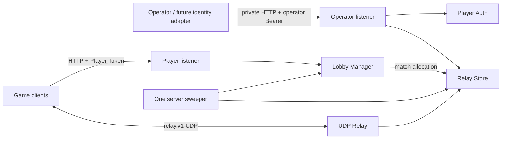

# [TRD v2.0] Go Room/Lobby, Quick Match & UDP Relay Server

| 항목 | 값 |
|---|---|
| 갱신일 | 2026-08-20 |
| 상태 | Milestone 1 verified; Phase 1–5 implemented; Phase 6–9 pending |
| module | `github.com/gyungsubLee/go-lobby-relay` |
| runtime | Go 1.26.5, single process, in-memory |
| 관련 문서 | [PRD](./PRD.md), [Requirements](../.planning/REQUIREMENTS.md), [Roadmap](../.planning/ROADMAP.md) |

> ADR 0001–0003과 Phase 1–3 evidence는 기존 Relay wire, lifecycle, admission과 security의 권위 문서다. 이 TRD는 그 구현을 변경하지 않고 Player Token, mutable Lobby, FIFO Quick Match와 별도 player HTTP listener를 추가한다.

## 1. Technical Goals

- verified Player Token claim만 player identity로 사용한다.
- mutable Lobby와 immutable Relay allocation을 분리한다.
- compatible FIFO tickets를 one-shot Relay match로 전환한다.
- operator HTTP, player HTTP와 UDP listener를 한 process 안에서 분리한다.
- exact deadline, hard limit, privacy와 all-or-nothing mutation을 제공한다.
- existing Relay protocol, security, race/fuzz evidence를 regression 없이 유지한다.

## 2. Non-goals

- JWT/OAuth/OIDC provider, anonymous login 또는 Steam ownership validation
- party/team/skill/region/backfill/configurable match functions
- authoritative gameplay, Unity/FishNet server runtime, payload parsing
- persistence, multi-process ownership, distributed lock 또는 message broker
- WebSocket presence/server push; M1 client state는 bounded HTTP polling

## 3. Stack and Dependency Budget

Production direct modules remain:

```text
google.golang.org/protobuf v1.36.11
golang.org/x/time v0.15.0
```

New code uses only Go standard library packages including `crypto/hmac`, `crypto/sha256`, `crypto/rand`, `encoding/base64`, `encoding/binary`, `encoding/json`, `net/http`, `sort`, `sync` and `time`.

## 4. Runtime Architecture



### 4.1 Package ownership

| Package | Responsibility | Mutable authority |
|---|---|---|
| `internal/playerauth` | process-ephemeral Player Token issue/verify | derived key only |
| `internal/lobby` | Lobby, membership, ready, ticket, assignment and match transition | all Lobby/Match maps under one mutex |
| `internal/playerapi` | Player Bearer auth, strict JSON/routes, domain-to-HTTP mapping | limiter/semaphore only |
| `internal/control` | operator auth, token issue, existing Relay room API | limiter/semaphore only |
| `internal/store` | existing immutable Relay room/grant/binding/admission state | existing store mutex |
| `internal/relay` | existing UDP decode/admission/fan-out | socket and fixed buffers |
| `internal/server` | bind, composition, four owned loops, shutdown/join | lifecycle flags only |

Lock direction is `lobby.Manager.mu -> store.Store.mu` during allocation. Store code never calls Lobby code, so reverse acquisition does not exist.

## 5. Player Token Contract

### 5.1 Startup key derivation

At startup:

1. read exactly 32 CSPRNG bytes as `process_nonce`;
2. derive `player_key = HMAC-SHA256(operator_secret, "go-lobby-relay/player-token/v1\x00" || process_nonce)`;
3. retain only the derived key for process lifetime.

Restart generates a different process nonce and invalidates old Player Tokens even if the operator secret file is unchanged.

### 5.2 Token wire

Before raw-base64url encoding:

```text
version              1 byte, exact 1
expires_unix_nano    8 bytes, signed big endian, > 0
player_id_length     1 byte, 1..64
player_id            exact ASCII ValidID bytes
tag                   32-byte HMAC-SHA256 over all preceding bytes
```

Verification uses strict unpadded base64url, exact total length derived from `player_id_length`, structural validation before attacker-sized allocation, constant-time tag comparison, and authority rule `now >= expires_at => expired`.

TTL is exactly 15 minutes. Error values are fixed `invalid`, `expired`, or fatal random failure and never contain token/key/player input.

## 6. Lobby Domain

### 6.1 Model

```text
Lobby
  lobby_id            server CSPRNG ID
  owner_player_id     current owner
  visibility          public | private
  queue_key           ValidID game-mode key
  capacity            2..16
  state               open | matched | closed
  revision            uint64, increment every mutation
  sequence            server insertion order
  created/expires     wall + monotonic deadline
  members             map[player_id]Member

Member
  player_id
  ready               bool
  join_sequence       deterministic owner-transfer order
```

One `player_id` appears in at most one open/matched Lobby or live Quick Match ticket. A matched Lobby retains assignments until match expiry, preventing accidental overlapping allocation.

### 6.2 Lifecycle invariants

- create validates all fields and capacity before generating/committing an ID;
- creator is owner and not ready;
- public list includes only live open public Lobby summaries and is ordered by insertion sequence;
- private exact get is visible only to a member; join is allowed by exact ID;
- join and leave require exact current revision;
- membership change sets every remaining member `ready=false`;
- owner leave transfers to the lowest surviving join sequence;
- empty leave closes and removes player ownership immediately;
- ready changes only caller state and increments revision;
- start requires caller owner, exact revision, open state, full capacity and all ready;
- no Lobby mutation occurs until Relay allocation succeeds;
- after success, member set freezes and each member owns exactly one private Assignment.

### 6.3 Limits

| Limit | Value |
|---|---:|
| open/matched Lobby records | 256 |
| capacity/member count | 2..16 |
| Lobby TTL | default 30m, maximum 2h |
| public list limit | default 20, maximum 50 |
| player active ownership | 1 |
| ID / queue key | existing `ValidID`, 1..64 ASCII bytes |

Cursor is the decimal server insertion sequence of the last returned Lobby. Invalid, negative, overflow or non-canonical cursor is rejected.

## 7. Quick Match Domain

### 7.1 Ticket

```text
Ticket
  ticket_id
  player_id
  queue_key
  capacity            2..16
  state               queued | matched | cancelled | expired
  revision
  sequence            global FIFO order
  deadline            exact 2m
  assignment          caller-private, matched only
```

Queue compatibility key is exactly `(queue_key, capacity)`. M1 tickets contain one player only.

### 7.2 Match transition

Under the Lobby mutex:

1. remove logically expired queue heads from consideration;
2. select the first `capacity` queued tickets for the exact compatibility key;
3. stage match, Relay room and session IDs;
4. call existing `store.CreateRoom` with all selected participant IDs and a 2m room/grant expiry;
5. on failure, leave ticket state and FIFO order unchanged;
6. on success, mark selected tickets matched and attach the corresponding private assignment.

Cancel requires exact revision and only transitions queued tickets. Matched status is immutable until expiry; cancellation cannot revoke an already formed Relay room.

Hard maximum live ticket records is 4096. Exact deadline ends queue/match authority before sweep.

## 8. Relay Assignment

Assignment contains:

```text
match_id
room_id
player_id
session_id
grant_id             raw base64url on HTTP
grant_secret         raw base64url on HTTP
grant_expires_at
relay_endpoint       advertised host + port
```

The Lobby Manager copies the matching `store.GrantAllocation` into a player-indexed private record. HTTP derives caller identity from Player Token and never accepts a requested `player_id`; therefore one player cannot select another assignment.

Relay room ID and every session ID are generated before allocation from 16 CSPRNG bytes with valid prefixes. Collision draws are retried at most nine times. A successful Store allocation is the last fallible operation before the Lobby/Ticket matched commit.

## 9. HTTP Contracts

### 9.1 Common rules

- HTTP/1.1 JSON, UTF-8, exact `/v1` routes
- `Content-Type: application/json` on body methods
- exactly one Bearer header; operator and player token formats never overlap
- strict decoder, duplicate/unknown field rejection, one JSON value, 64KiB body maximum
- `Cache-Control: no-store` on every response
- fixed envelope:

```json
{"error":{"code":"conflict","message":"request conflicts with current state"}}
```

- fixed codes: `invalid_request`, `unauthorized`, `forbidden`, `not_found`, `conflict`, `capacity`, `rate_limited`, `unavailable`, `internal_error`
- no token, grant, key, payload, raw request body or high-cardinality secret in messages/logs

### 9.2 Operator listener

#### `POST /v1/player-tokens`

Request:

```json
{"player_id":"player-a"}
```

Response `201`:

```json
{"player_id":"player-a","token":"<opaque>","expires_at":"2026-08-20T12:15:00Z"}
```

Only existing operator Bearer authentication may call this route.

Existing `PUT|GET|DELETE /v1/rooms/{room_id}` remains unchanged and is not served on the player listener.

### 9.3 Player listener

#### `POST /v1/lobbies`

```json
{"visibility":"public","queue_key":"duel","capacity":2}
```

Returns `201` Lobby snapshot.

#### `GET /v1/lobbies?queue_key=duel&limit=20&cursor=<sequence>`

Returns public live Lobby summaries and optional `next_cursor`. Unknown query keys and repeated values are invalid.

#### `GET /v1/lobbies/{lobby_id}`

Returns full member state only when caller is a member. Non-member private state collapses to `not_found`.

#### `POST /v1/lobbies/{lobby_id}/join`

```json
{"revision":1}
```

#### `DELETE /v1/lobbies/{lobby_id}/members/me`

```json
{"revision":2}
```

#### `PUT /v1/lobbies/{lobby_id}/members/me/ready`

```json
{"revision":3,"ready":true}
```

#### `POST /v1/lobbies/{lobby_id}/start`

```json
{"revision":5}
```

Returns caller-private matched assignment. Other members obtain theirs from exact Lobby get after match; each response includes only the authenticated caller's assignment.

#### `POST /v1/matchmaking/tickets`

```json
{"queue_key":"duel","capacity":2}
```

Returns `201` queued or matched Ticket snapshot.

#### `GET /v1/matchmaking/tickets/me`

Returns caller ticket and caller-private assignment when matched.

#### `DELETE /v1/matchmaking/tickets/me`

```json
{"revision":1}
```

Returns cancelled Ticket snapshot; matched ticket cancellation returns conflict.

## 10. Server Composition and Lifecycle

Required CLI inputs:

```text
--management-listen
--player-listen
--relay-network udp4|udp6
--relay-listen
--advertised-host
--advertised-port
--operator-token-file
```

`server.New` validates every value, derives Player Auth, and binds management TCP → player TCP → UDP. Failure closes already-bound listeners in reverse order. `New` starts no goroutine.

`Run` owns exactly four loops:

1. management `http.Server.Serve`;
2. player `http.Server.Serve`;
3. UDP `Relay.Run`;
4. one 1s ticker calling Relay Store `Expire()` and Lobby Manager `Expire()`.

Caller cancellation, `Close`, fatal CSPRNG failure or unexpected owned-loop exit cancels siblings, closes all listeners, joins all four results and returns a fixed secret-free error for unexpected failure. After `Run` joins, all three addresses are reusable.

## 11. Existing Relay Contract

The following implemented properties remain unchanged:

- proto3 `relay.v1`, protocol revision `1`
- one datagram = one bounded envelope
- maximum datagram `1200`, opaque payload `900`
- HELLO→CHALLENGE→AUTH→BOUND with exact-source binding
- binding-scoped 64-bit replay window
- HMAC-authenticated client data and server fan-out
- same-room active/bound recipients excluding sender
- queue-free synchronous one-attempt writes with bounded deadline
- pre-auth/session/room/process packet/byte limits and room/process fan-out limits
- exact monotonic authority and bounded cleanup/tombstones

References: [ADR 0001](./decisions/0001-m1-wire-and-threat-boundary.md), [ADR 0002](./decisions/0002-m1-control-lifecycle-policy.md), [ADR 0003](./decisions/0003-m1-udp-admission-and-fanout-policy.md).

## 12. Error, Privacy and Cleanup Invariants

- auth failure cannot reveal whether player, Lobby, ticket, room or grant exists;
- private Lobby never appears in list;
- non-member exact private get returns the same not-found shape as unknown;
- response assignment is indexed only by verified claim;
- mutation validates auth, path/body, limits, ownership, revision and deadline before state change;
- allocation failure creates no matched Lobby/Ticket state;
- expiry is authoritative at `now >= deadline` regardless of sweep;
- one server sweeper removes expired Lobby/Ticket/assignment and existing Relay records;
- process restart intentionally loses all state and invalidates Player Tokens via process nonce.

## 13. Verification Matrix

| Boundary | Required evidence |
|---|---|
| Player Token | valid, exact expiry, tamper, strict encoding, different secret/nonce, fatal random |
| Lobby | create/list/privacy, capacity, revision, join/leave, owner transfer, ready reset, start gates, exact expiry |
| Quick Match | FIFO equality/one-over, key/capacity isolation, cancel, expiry, rollback, concurrent grouping |
| HTTP | exact routes/methods, auth, strict JSON/query, bounds, fixed errors, no-store, redaction |
| Assignment | caller-private grant, no cross-player selection, Relay room definition correctness |
| E2E | Lobby and Quick Match HTTP→two UDP binds→same-room exchange |
| Lifecycle | bind rollback, four-loop cancellation/fatal join, address reuse, restart token invalidation |
| Regression | protocol-check, all Go tests, race, protocol/Relay fuzz, vet, binary build |

M1 completion evidence is recorded only from a clean candidate after all rows pass.

## 14. Requirement Traceability

| Component | Requirements | Phase |
|---|---|---:|
| existing protocol/store/control/relay/server | PROT-01~02, ROOM-01~03, SESS-01~04, RELY-01~03, SAFE-01~03 | 1–3 complete |
| `internal/playerauth`, operator token endpoint | AUTH-01 | 4 complete |
| `internal/lobby` lifecycle, `internal/playerapi` | LOBBY-01~04 | 4 complete |
| `internal/lobby` matcher and assignment, E2E | MATCH-01~03 | 5 complete |
| actual C# game client integration | UNITY-01~03 | 6 |
| operations | OPS-01~04 | 7 |
| packaging/deployment | SHIP-01~03 | 8 |
| drills/performance | VERI-01~02, PERF-01~02 | 9 |

## 15. Deferred Adoption Triggers

| Candidate | Adopt only when |
|---|---|
| Steamworks | real Steam identity/invite flow is selected and its ticket verification boundary is approved |
| FishNet | actual gameplay client chooses FishNet and Relay/transport responsibility is defined |
| Open Match | FIFO exact-key matching cannot express required pools/functions/backfill |
| Redis/database | restart loss or multi-process ownership is no longer acceptable with explicit consistency semantics |
| Kubernetes/Agones | measured single-host limits require a multi-instance fleet |

M1 contains no scaffolding for these candidates.
