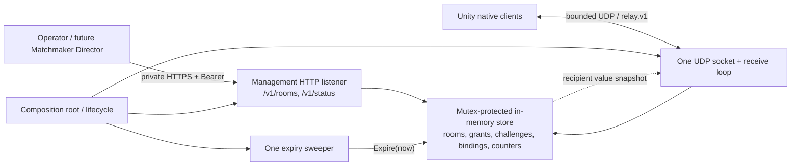
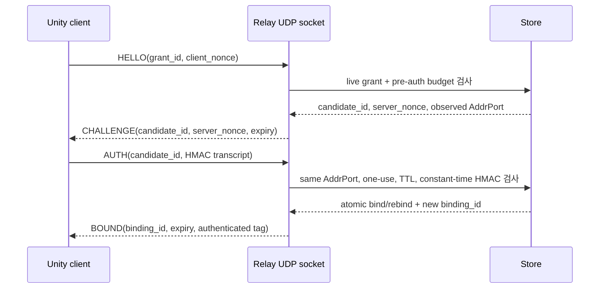

# [TRD v1.0] Go 기반 초경량 게임 패킷 Relay & Session Server

| 항목 | 값 |
|---|---|
| 작성일 | 2026-08-08 |
| 상태 | **Phases 1–2 protocol, store, and room-control HTTP implemented / Phase 3–7 planned** |
| 대상 | Milestone 1–2, Phase 1–7 |
| 관련 문서 | [PRD](./PRD.md), [PROJECT](../.planning/PROJECT.md), [REQUIREMENTS](../.planning/REQUIREMENTS.md), [ROADMAP](../.planning/ROADMAP.md) |

> **구현 상태 경계:** Phase 1의 bounded Protobuf contract와 Phase 2의 인메모리 room/grant store, expiry/cleanup, `PUT|GET|DELETE /v1/rooms/{room_id}` handler, Bearer 인증과 HTTP 상한은 구현·검증됐다. [Phase 2 evidence](./evidence/m1/phase-2.md)는 이 범위만 완료한다. 실행 binary/listener 조립, `/v1/status`, UDP bind/replay/relay, endpoint cleanup, Unity native, 운영·배포와 성능 계약은 아직 **planned**이며 현재 동작을 보증하지 않는다. 이후 Phase 검증 결과가 계약 변경을 요구하면 REQUIREMENTS와 ROADMAP을 먼저 승인·갱신한 뒤 본 문서를 함께 개정한다.

## 1. 기술 목표, 비목표, 결정 요약

### 1.1 목표

- 인증된 Unity PC와 선택한 Android 또는 iOS 모바일 네이티브 참가자 사이에서 작은 opaque UDP payload를 같은 room 안으로만 낮은 지연으로 중계한다.
- room, participant session, grant, challenge, endpoint binding의 수명주기를 단일 Go 프로세스 메모리에서 원자적으로 관리한다.
- 저빈도 HTTP 관리면과 고빈도 UDP 데이터면을 분리하되 하나의 상태 소유자를 사용한다.
- Go와 C#이 공유하는 versioned, bounded Protobuf wire contract와 재현 가능한 생성·호환성 검사를 제공한다.
- 잘못된 입력, spoofing, replay, amplification, 느린 수신자와 overload가 다른 room이나 프로세스 가용성을 고갈시키지 않게 한다.
- CGO 없는 단일 Linux binary와 최소 Docker image로 단일 호스트에서 관찰·drain·종료·복구·측정할 수 있게 한다.

### 1.2 비목표

- Unity Headless, 서버 권위 물리·게임 상태, payload 해석, prediction 또는 full anti-cheat
- reliable/ordered delivery, ACK, retry, disconnected buffering 또는 gameplay-level deduplication
- WebGL/WebSocket/WebRTC, P2P hole punching, STUN/TURN/ICE
- 영속 room, 재시작 복구, 다중 Relay 간 state sharing·migration·failover
- Redis/Postgres, Kubernetes, Agones, Open Match 2 runtime, service mesh의 v1 도입 또는 선행 scaffold
- admin UI, plugin framework, generic SDK framework, Prometheus/OpenTelemetry stack
- gameplay payload confidentiality와 모든 on-path 공격에 대한 완전한 보호
- room 생성 뒤 membership 변경, 개별 participant revoke/leave 또는 기존 room의 grant 재발급

### 1.3 결정 요약

| 결정 | planned 계약 | 이유 |
|---|---|---|
| 실행 단위 | CGO-free Go 프로세스 1개 | 가장 작은 운영·실패 경계 |
| 네트워크 | public UDP socket 1개 + private management HTTP listener 1개 | packet/control 부하와 권한 분리 |
| 상태 | Go map + `sync.RWMutex` 한 개의 concrete store | 관련 index를 한 번에 전이하고 분산 조정 제거 |
| 만료 | expiry sweeper 1개, per-object timer 없음 | churn에도 goroutine/timer 수 고정 |
| HTTP | HTTP/1.1 JSON `/v1`, `net/http` | 낮은 호출량에 framework/gRPC 불필요 |
| UDP | proto3 `relay.v1`, 한 datagram = 한 envelope | Go/C# 호환성과 명시적 bounds |
| relay | queue-free best-effort same-room fan-out | UDP 손실을 heap growth로 바꾸지 않음 |
| 향후 matchmaker | `Match -> PUT /v1/rooms/{room_id}` 외부 adapter | Relay 내부에 Open Match 결합을 만들지 않음 |

## 2. 최소 기술 스택과 의존성 budget

Phase 1의 Go 1.26.5, Buf 1.72.0, Protobuf Go/C# runtime과 .NET 9.0.305는 고정된 버전으로 실제 실행·검증됐다. Unity 6.3 native target build, Linux release target과 target-network 동작은 아직 검증되지 않았다.

| 영역 | 기술 / 버전 | 용도 | 분류 |
|---|---|---|---|
| 서버 | Go **1.26.5**, standard library | UDP, HTTP, JSON, crypto, logging, concurrency, lifecycle, tests | production |
| Go wire runtime | `google.golang.org/protobuf` **v1.36.11** | generated message와 binary encoding | production |
| rate limit | `golang.org/x/time/rate` **v0.15.0** | concurrent-safe token bucket | production |
| schema | proto3, package **`relay.v1`** | UDP wire source of truth | contract |
| compiler | Protocol Buffers **35.1** | Go/C# generation | development only |
| schema workflow | Buf CLI **1.72.0**, pinned image/plugin revision | lint, breaking, generate | development only |
| Unity | Unity **6.3 LTS**, exact `6000.3.x` patch는 Phase 4에서 고정 | native sample | client |
| C# runtime | `Google.Protobuf` **3.35.1** | generated C# message | client |
| client socket | `System.Net.Sockets.Socket`, .NET Standard 2.1 profile | UDP lifecycle | client |
| host | Linux; exact `GOARCH`는 Phase 6 기준 host로 고정, Docker Engine **29.6.2+ patched 29.x** | single-host operation | deployment |
| image | `golang:1.26.5-bookworm` pinned digest -> `scratch` | reproducible build / minimal runtime | deployment |

### 2.1 서버 direct runtime dependency budget

```text
google.golang.org/protobuf v1.36.11
golang.org/x/time v0.15.0
```

이 둘 외 direct production module은 v1 budget에 포함하지 않는다. `crypto/rand`, `crypto/hmac`, `crypto/sha256`, `crypto/subtle`, `encoding/base64`, `encoding/json`, `flag`, `net`, `net/netip`, `net/http`, `log/slog`, `os/signal`, `sync`, `testing`을 우선한다. stdlib-first는 binary·RSS·CVE·upgrade surface를 작게 하고, 세 HTTP path뿐인 API에 router/RPC/config/DI/logger/JWT/UUID/metrics framework를 소유하지 않기 위해서다. 단, untrusted UDP 경계의 token bucket은 직접 재구현하는 것보다 검증된 `x/time/rate` 한 모듈이 더 작고 안전하다.

## 3. Planned runtime architecture



Phase 3의 최소 composition root는 accepted fixed/default 값과 M1 launch input을 listener bind 전에 검증하고 HTTP, UDP, sweeper를 같은 store에 연결하며 context 취소 시 socket close와 owned goroutine join을 수행한다. Phase 5는 이 조립점을 교체하지 않고 full config precedence, readiness/status, signal/drain과 ordered deadline shutdown을 추가한다. HTTP handler goroutine, UDP receive goroutine, sweeper goroutine은 mutable domain state를 소유하지 않는다.

### 3.1 컴포넌트 책임

| 컴포넌트 | 책임 | mutable state |
|---|---|---|
| composition root / lifecycle | Phase 3 최소 구성·context close/join; Phase 5 full config, signal, readiness, drain, ordered shutdown | process flags만 |
| management HTTP adapter | Bearer 인증, bounded JSON decode, store error의 HTTP mapping, redaction, status | 없음 |
| UDP relay adapter | bounded read/parse, bind/rebind, packet admission, recipient writes | socket와 고정 buffer만 |
| protocol codec | generated types, version/bounds 검사, canonical HMAC transcript | 없음 |
| room/session store | room/grant/challenge/binding/index/rate state의 모든 원자 전이 | **전체 domain state** |
| expiry sweeper | ticker마다 `Expire(now)` | ticker만 |
| Unity `RelayClient` sample | socket/cancellation, client state machine, main-thread delivery | client-local |
| independent Go load client | named workload, latency/loss/resource evidence | test-run-local |

### 3.2 Boring package layout (planned)

```text
api/relay/v1/relay.proto
cmd/relay/main.go
cmd/relay-load/main.go
internal/server/server.go
internal/control/http.go
internal/relay/udp.go
internal/store/store.go
internal/protocol/codec.go
gen/go/relay/v1/
unity/RelaySample/Assets/Relay/
Dockerfile
deploy/relay.service
```

`repository`, `service`, `factory`, actor, event bus, transport plugin, allocator interface는 만들지 않는다. 안정 seam은 versioned HTTP contract와 Protobuf contract 두 개다.

### 3.3 State / concurrency invariants

1. `roomsByID`, `grantsByID`, `bindingsByID`, pending challenge와 counters는 store의 한 `sync.RWMutex` 아래 함께 변경한다.
2. room/session 전이는 단일 critical section에서 원자적이다. adapter가 index를 직접 수정하지 않는다.
3. lock 안에서는 network I/O, Protobuf marshal, JSON encode, structured logging을 하지 않는다.
4. `ClientData`/`Ping`의 첫 exclusive lock에서 binding generation, exact endpoint, authoritative ID/deadline, HMAC, replay 분류와 authenticated ingress를 함께 선형화한다. fresh sequence는 ingress 거부에도 소비하고 replay는 window를 바꾸지 않는다. derived key는 store 밖으로 내보내지 않으며, 최대 `900`-byte payload의 HMAC을 이 lock 안에서 계산하는 것이 M1의 의도된 ceiling이다.
5. ingress 성공 뒤 lock 밖에서 authoritative snapshot으로 `ServerData`를 marshal하고 output cap을 검사한다. 두 번째 exclusive lock은 generation/deadline을 재검사하고 현재 recipient 계산, room/process fan-out 원자 소비와 `netip.AddrPort` snapshot만 수행한다. 그 뒤 lock을 해제하고 best-effort write하며 ingress/fan-out token은 후속 실패에 환불하지 않는다.
6. room별 goroutine, socket, channel, timer, retry queue가 없다. application queue 크기는 0이다.
7. source address는 선택한 `udp4`/`udp6` family와 일치해야 하며 OS별 mapped-address 동작에 의존하지 않는다. 인증은 canonical exact `netip.AddrPort`로 비교하고 IP만 사용하지 않는다.
8. 서버 monotonic 시간이 권위이며 만료 경계는 `now >= deadline`이다. 외부 `expires_at`은 그 deadline의 UTC 표현이고, 권한 거부는 sweep을 기다리지 않고 즉시 적용한다.
9. rebind가 성공하기 전까지 기존 binding은 유효하며, 성공과 동시에 새 random binding ID/endpoint로 교체한다.
10. 프로세스 재시작은 모든 room/grant/challenge/binding을 의도적으로 무효화한다.

## 4. HTTP API contract

Phase 2는 이 절의 room `PUT`/`GET`/`DELETE` handler와 schema, 엄격한 decoding, 인증, redaction, body/header/time bound를 구현·검증했다. Phase 3는 M1 native client 검증에 필요한 최소 HTTP+UDP listener와 sweeper를 단일 binary로 조립한다. VM/Docker bind mode, full config precedence, remote transport, `/v1/status`, readiness/drain과 signal lifecycle은 Phase 5까지 **planned**다.

### 4.1 공통 규칙

| 항목 | 계약 |
|---|---|
| base URL | VM은 `http://127.0.0.1:8080`; Docker는 container `0.0.0.0:8080`을 host `127.0.0.1`에만 publish; 원격 접근은 host TLS proxy 또는 SSH tunnel이 담당 |
| version prefix | `/v1` |
| 인증 | 모든 endpoint에 `Authorization: Bearer <operator-token>` 필수 |
| transport | `management_mode=loopback|container`; container mode는 namespace 안 wildcard bind를 허용하되 host-loopback publish를 runbook으로 검증; Relay 안에 direct TLS mode/cert 설정 없음 |
| media type | body가 있는 request는 `Content-Type: application/json` 필수; 모든 JSON response는 `application/json`; `DELETE 204`만 body 없음 |
| key / time | JSON `snake_case`; RFC 3339 UTC (`Z`), server-authoritative |
| decoding | 64 KiB body cap, unknown field 거부, JSON value 정확히 1개, trailing data 거부 |
| idempotency | 별도 `Idempotency-Key` 없이 path `room_id` + immutable canonical definition 사용 |
| disclosure | 모든 response에 `Cache-Control: no-store`; operator token·grant secret·game payload를 log/status/GET에 노출하지 않음 |

v1에는 arbitrary metadata JSON field가 없다. SAFE-01의 metadata boundary는 room/participant/session ID 64 bytes와 HTTP `MaxHeaderBytes=16 KiB`를 뜻한다.

missing/invalid Bearer token은 constant-time 비교 후 room 존재 여부와 무관하게 `401`과 `WWW-Authenticate: Bearer`를 반환한다. token format과 startup validation은 §8.1의 정확히 43-character base64url 계약을 따른다. endpoint listing은 제공하지 않는다. canonical route만 허용해 trailing slash와 percent-encoded ID는 `404`; 허용되지 않은 method는 `405`와 `Allow`, body가 금지된 GET/DELETE에 body가 있으면 `400`, body가 있는 요청의 media type이 다르면 `415`다.

### 4.2 공통 error envelope

```json
{
  "error": {
    "code": "conflict",
    "message": "room_id already exists with a different immutable definition"
  }
}
```

| field | type | 규칙 |
|---|---|---|
| `error.code` | string enum | client 분기에 사용하는 bounded code |
| `error.message` | string | secret/존재 정보를 과도하게 드러내지 않는 설명 |

고정 code는 `invalid_request`, `unauthorized`, `not_found`, `method_not_allowed`, `conflict`, `body_too_large`, `unsupported_media_type`, `capacity_exceeded`, `rate_limited`, `draining`, `internal_error`다. 대응 status는 각각 `400`, `401`, `404`, `405`, `409`, `413`, `415`, `422`, `429`, `503`, `500`이다. `/v1/status`의 `503`은 error envelope 대신 status schema를 반환한다.

### 4.3 Endpoint summary

| method | path | auth | 성공 status | 목적 | 구현 상태 |
|---|---|---|---|---|---|
| `PUT` | `/v1/rooms/{room_id}` | operator Bearer | 최초 `201`, 동일 재시도 `200` | room과 participant grant 할당 | Phase 2 complete |
| `GET` | `/v1/rooms/{room_id}` | operator Bearer | `200` | secret이 redacted된 room 상태 | Phase 2 complete |
| `DELETE` | `/v1/rooms/{room_id}` | operator Bearer | 멱등 `204` | room 종료·전체 자격 폐기 | Phase 2 complete |
| `GET` | `/v1/status` | operator Bearer + private | ready `200`, 그 외 `503` | 단일 health + status surface | Phase 5 planned |

`/livez`, `/readyz`와 public health endpoint는 planned contract에 없다.

### 4.4 `PUT /v1/rooms/{room_id}`

`room_id`는 caller-supplied stable allocation ID다. 호출자는 한 번 사용한 ID를 의도적으로 재사용하지 않는다. 최초 valid definition은 room과 32-byte CSPRNG grant secret을 participant별로 만든다. byte-for-byte JSON이 아니라 정규화된 immutable field 값이 같으면 동일 정의다. timestamp는 같은 instant로, participants는 `(participant_id, session_id)` keyed set으로 비교하므로 JSON 순서는 의미가 없다.

**Request example**

```json
{
  "capacity": 2,
  "expires_at": "2026-08-08T13:00:00Z",
  "participants": [
    {
      "participant_id": "player-a",
      "session_id": "session-a",
      "grant_expires_at": "2026-08-08T12:30:00Z"
    },
    {
      "participant_id": "player-b",
      "session_id": "session-b",
      "grant_expires_at": "2026-08-08T12:30:00Z"
    }
  ]
}
```

| request field | type | required | validation |
|---|---|---|---|
| path `room_id` | string | yes | ASCII `^[A-Za-z0-9][A-Za-z0-9._-]{0,63}$`; raw percent encoding 불허 |
| `capacity` | uint32 | yes | v1은 membership mutation이 없으므로 `participants.length == capacity <= configured maximum` |
| `expires_at` | timestamp | yes | server 수신 시각보다 미래, configured maximum TTL 이내 |
| `participants` | array | yes | non-empty, participant/session ID 모두 room 내 unique, configured cap 이내 |
| `participant_id` | string | yes | 위와 같은 ASCII alphabet, UTF-8 byte length 1~64 |
| `session_id` | string | yes | 위와 같은 ASCII alphabet, UTF-8 byte length 1~64; room 내 unique |
| `grant_expires_at` | timestamp | yes | 미래이고 `<= expires_at`, configured grant TTL 이내 |

**`201 Created` response example** (`200 OK` 동일 schema)

```json
{
  "room_id": "match-20260808-001",
  "state": "open",
  "created_at": "2026-08-08T12:00:00Z",
  "expires_at": "2026-08-08T13:00:00Z",
  "capacity": 2,
  "relay_endpoint": {"host": "relay.example.net", "port": 30000},
  "protocol_revision": 1,
  "max_datagram_bytes": 1200,
  "max_payload_bytes": 900,
  "grants": [
    {
      "participant_id": "player-a",
      "session_id": "session-a",
      "grant_id": "n_NN6sQYB8ZGB2GcpKUWtg",
      "grant_secret": "Tm9uUHJvZHVjdGlvbkV4YW1wbGVTZWNyZXQxMjM",
      "grant_expires_at": "2026-08-08T12:30:00Z",
      "state": "issued"
    },
    {
      "participant_id": "player-b",
      "session_id": "session-b",
      "grant_id": "w5E6i4Q4XcI5G5h5JqPTJQ",
      "grant_secret": "QW5vdGhlck5vblByb2R1Y3Rpb25TZWNyZXQxMjM",
      "grant_expires_at": "2026-08-08T12:30:00Z",
      "state": "issued"
    }
  ]
}
```

| response field | type | meaning |
|---|---|---|
| `room_id`, `state` | string | path ID; `state`는 `open` |
| `created_at`, `expires_at` | timestamp | server creation time / authoritative room deadline |
| `capacity` | uint32 | immutable room capacity |
| `relay_endpoint.host`, `.port` | string, uint16 | client가 address-family-neutral DNS resolve로 사용하는 advertised UDP destination; listen address와 다를 수 있음 |
| `protocol_revision` | uint32 | v1은 `1` |
| `max_datagram_bytes` | uint32 | envelope 포함 accepted total cap `1200` |
| `max_payload_bytes` | uint32 | `ClientData.payload`와 relayed payload의 accepted cap `900`; 양쪽 envelope worst-case fixture로 검증 |
| `grants[]` | array | participant별 allocation |
| `grant_id` | base64url string | 16 random bytes, no padding |
| `grant_secret` | base64url string | 32 random bytes, no padding; live grant의 PUT response에서만 노출 |
| `grants[].state` | enum | `issued`, `bound`, `expired`, `revoked` |

동일 `room_id`의 **open room**에 동일 immutable definition을 재시도하면 state를 새로 만들지 않고 `200`을 반환한다. live grant는 같은 secret/expiry를 반환한다. open room 안의 terminal grant를 재발급하거나 TTL을 연장하지 않으며 해당 항목은 secret을 생략한다. 다른 capacity, expiry, participant/session set 또는 grant expiry는 `409 conflict`다. room 자체가 terminal이거나 `now < tombstone_deadline`인 live tombstone이면 정의가 같아도 `409 conflict`이며 정상적인 새 allocation은 새 `room_id`를 사용한다. tombstone deadline부터 server는 same-ID record를 absent로 취급해 재생성을 막지 않지만 caller는 ID를 의도적으로 재사용하지 않는다. bounded tombstone은 지연된 재시도를 막는 안전창이지 영구 ID registry가 아니다. Phase 2는 participant/session tuple마다 grant 하나를 구현했고, pending challenge 하나와 active binding 하나 제한은 Phase 3 계약이다.

### 4.5 `GET /v1/rooms/{room_id}`

**`200 OK` response example**

```json
{
  "room_id": "match-20260808-001",
  "state": "open",
  "created_at": "2026-08-08T12:00:00Z",
  "expires_at": "2026-08-08T13:00:00Z",
  "capacity": 2,
  "relay_endpoint": {"host": "relay.example.net", "port": 30000},
  "protocol_revision": 1,
  "max_datagram_bytes": 1200,
  "max_payload_bytes": 900,
  "participants": [
    {
      "participant_id": "player-a",
      "session_id": "session-a",
      "grant_state": "issued",
      "grant_expires_at": "2026-08-08T12:30:00Z",
      "binding_state": "unbound"
    },
    {
      "participant_id": "player-b",
      "session_id": "session-b",
      "grant_state": "issued",
      "grant_expires_at": "2026-08-08T12:30:00Z",
      "binding_state": "unbound"
    }
  ]
}
```

| field | type | meaning |
|---|---|---|
| room 공통 필드 | PUT response와 동일 | secret 제외 상태 snapshot |
| `participants[].grant_state` | enum | Phase 2는 `issued`, `expired`, `revoked`; `bound`는 Phase 3 planned |
| `participants[].binding_state` | enum | Phase 2는 `unbound`, `expired`, `revoked`; `bound`, `rebind_pending`은 Phase 3 planned |

`grant_secret`, derived key, challenge nonce, binding ID와 observed endpoint는 절대 포함하지 않는다. room이 access-time expiry, DELETE 또는 empty 판정으로 terminal이 되는 순간부터 physical cleanup 전이라도 GET은 `404`다. tombstone 존재 여부도 노출하지 않는다. 같은 ID의 PUT은 tombstone window 동안 `409`다.

### 4.6 `DELETE /v1/rooms/{room_id}`

request body는 허용하지 않는다. open room은 즉시 종료하고 Phase 2의 grant를 원자적으로 revoke한다. Phase 3는 같은 room-wide 동작에 challenge와 binding 폐기를 추가해 ROOM-03을 닫는다. 이것이 v1의 유일한 명시적 revoke 동작이며 개별 participant revoke endpoint는 없다. 이미 종료·만료·삭제됐거나 한 번도 없던 ID도 `204 No Content`이며 response body가 없다. previously-known room만 bounded tombstone을 남겨 동일 PUT의 즉시 resurrection을 막는다. 한 번도 없던 ID의 DELETE는 미래의 정상 생성을 막는 tombstone을 만들지 않으며, tombstone은 GET에서 보이지 않는다.

### 4.7 `GET /v1/status` (planned)

이 endpoint가 유일한 authenticated/private health + status surface다. management와 UDP listener가 준비되고 relay loop가 admission을 받는 `ready`만 `200`; `starting`, `draining`, `unhealthy`는 같은 JSON schema로 `503`이다.

scratch container에는 `curl`을 추가하지 않는다. Docker/VM health check는 같은 바이너리의 local status-check subcommand가 operator token을 권한 제한 파일 또는 environment에서 읽어 이 endpoint를 호출한다. public unauthenticated health route는 만들지 않는다.

**Planned `200 OK` response example**

```json
{
  "status": "ready",
  "build_version": "1.0.0-dev",
  "source_revision": "a1b2c3d",
  "protocol_revision": 1,
  "started_at": "2026-08-08T11:59:58Z",
  "uptime_ms": 122000,
  "listeners": {"management": "ready", "relay_udp": "ready"},
  "counts": {"rooms": 1, "sessions": 2, "bound_sessions": 1, "pending_challenges": 0},
  "counters": {"udp_received": 1042, "client_data_accepted": 902, "udp_dropped": 140, "fanout_write_attempts": 902, "fanout_write_successes": 900, "fanout_write_errors": 2},
  "drop_reasons": {"malformed": 10, "rate_limited": 130}
}
```

| field | type | planned meaning |
|---|---|---|
| `status` | enum | `starting`, `ready`, `draining`, `unhealthy` |
| build/source/protocol | string/string/uint32 | artifact identity |
| `started_at`, `uptime_ms` | timestamp, uint64 | process lifecycle |
| `listeners` | fixed object | management/UDP readiness |
| `counts` | fixed gauges | active aggregate state; room/session IDs 없음 |
| `counters` | fixed counters | 아래 단위의 process-lifetime aggregate totals |
| `drop_reasons` | bounded enum-key object | 0인 key는 생략 가능; high-cardinality label 없음 |

`udp_received`는 socket read 한 건, `client_data_accepted`는 final admission을 통과한 입력 `ClientData` 한 건, `fanout_write_attempts/successes/errors`는 recipient write 한 건 단위다. `udp_dropped`는 admission 전에 한 reason으로 거부한 입력 datagram 수이며 항상 `sum(drop_reasons)`와 같다. post-admission recipient write 실패는 `fanout_write_errors`에만 들어가고 `udp_dropped`에는 들어가지 않는다.

fixed input drop reason enum은 `malformed`, `oversized`, `unsupported_version`, `unknown_grant`, `auth_failed`, `replay`, `expired`, `revoked`, `wrong_room`, `wrong_endpoint`, `not_bound`, `rate_limited`, `fanout_limited`, `draining`이다.

## 5. Implemented UDP Protobuf wire contract

### 5.1 Namespace와 envelope

| 항목 | contract 값 |
|---|---|
| syntax / application package | `proto3` / `relay.v1` |
| Go namespace | generated path `gen/go/relay/v1`, package `relayv1` |
| C# namespace | `Relay.V1` |
| application revision | `1` |
| framing | 한 UDP datagram = 한 `Envelope`; fragmentation/reassembly 없음 |

`api/relay/v1/relay.proto`가 실제 wire source of truth이고, `gen/go/relay/v1/relay.pb.go`와 `unity/RelaySample/Assets/Relay/Generated/Relay.cs`는 고정된 Buf workflow로 생성해 함께 체크인한다. 아래 구조는 그 구현된 계약의 요약이며 수동 편집 대상이 아니다.

```proto
message Envelope {
  uint32 protocol_revision = 1;
  uint64 sequence = 2;
  bytes auth_tag = 3;
  string session_id = 4;
  string room_id = 5;
  oneof body {
    Hello hello = 10;
    Challenge challenge = 11;
    Auth auth = 12;
    Bound bound = 13;
    ClientData client_data = 14;
    ServerData server_data = 15;
    Ping ping = 16;
  }
}

message Hello      { bytes grant_id = 1; bytes client_nonce = 2; bytes padding = 3; }
message Challenge  { bytes candidate_id = 1; bytes server_nonce = 2; int64 expires_unix_ms = 3; }
message Auth       { bytes candidate_id = 1; }
message Bound      { bytes binding_id = 1; int64 expires_unix_ms = 2; }
message ClientData { bytes binding_id = 1; bytes payload = 2; }
message ServerData { string sender_participant_id = 1; bytes payload = 2; }
message Ping       { bytes binding_id = 1; }
```

oneof field가 packet kind다. removed field number/name은 reserve하며 재사용하지 않는다. `room_id`, `session_id`, `sender_participant_id`는 1~64 ASCII bytes와 §4.4의 alphabet을 사용한다. `grant_id`, client nonce, candidate ID, binding ID는 각각 16 bytes, server nonce와 HMAC-SHA-256 tag는 32 bytes다. handshake의 `sequence`는 0, bound client message는 binding별 1부터 증가한다. `ServerData.sequence`는 수락된 sender sequence를 보존한다.

decoder는 unknown field, final body 없음, 잘못된 direction, 고정 길이 위반과 message에 허용되지 않은 non-default field를 거부한다. proto3 표준대로 같은 singular/oneof field가 wire에 반복되면 generated decoder의 last-one-wins를 수용하고 **최종 decoded body만** 검증한다. 1200-byte cap이 반복 field parsing work를 bound하며 별도 `protowire` structural scan은 만들지 않는다. server state lookup은 globally random `grant_id`, `candidate_id` 또는 `binding_id`로만 시작하고 client가 보낸 `room_id`/`session_id`는 lookup 결과와 일치하는지만 확인한다. ID 충돌은 overwrite하지 않고 새 random ID를 생성한다.

| packet | sequence | `auth_tag` | body 추가 규칙 |
|---|---:|---|---|
| `HELLO` | `0` | empty | grant/client nonce 각 16 bytes, total datagram 256~1200 bytes |
| `CHALLENGE` | `0` | empty | candidate 16, server nonce 32, future expiry |
| `AUTH` | `0` | exactly 32 bytes | candidate 16 |
| `BOUND` | `0` | exactly 32 bytes | binding 16, future expiry |
| `ClientData` | `>=1` | exactly 32 bytes | binding 16, payload 0~900 bytes |
| `ServerData` | accepted sender sequence | empty | authoritative sender ID 1~64, payload 0~900 bytes |
| `Ping` | `>=1` | exactly 32 bytes | binding 16 |

### 5.2 Message contract

| message | direction | auth | 의미 |
|---|---|---|---|
| `HELLO` | client -> server | 없음, pre-auth limit | live grant ID, fresh client nonce와 non-reflected padding으로 challenge 요청 |
| `CHALLENGE` | server -> client | 주소 검증 전, encoded response가 해당 HELLO datagram보다 작은 경우만 전송 | observed endpoint에 묶인 one-use candidate와 nonce |
| `AUTH` | client -> server | grant secret HMAC | grant possession + 같은 observed endpoint 증명 |
| `BOUND` | server -> client | derived binding key HMAC | random binding ID와 deadline 확정 |
| `ClientData` | client -> server | binding key HMAC + replay window | opaque gameplay payload |
| `ServerData` | server -> clients | v1은 exact relay source만 검증하고 `auth_tag`는 비움 | authoritative sender ID + unchanged payload |
| `Ping` | client -> server | binding key HMAC + replay window | otherwise-idle binding activity; relay payload 아님 |

### 5.3 HELLO -> CHALLENGE -> AUTH -> BOUND (planned)



client는 64-byte room/session ID를 포함한 worst-case CHALLENGE보다 크게 HELLO가 **최소 256 bytes**가 되도록 zero-filled `padding`을 조절하며 server는 padding을 cap 검증 뒤 버리고 응답이나 HMAC transcript에 반영하지 않는다. server는 실제 CHALLENGE가 해당 accepted HELLO datagram보다 **strictly smaller**일 때만 보낸다. unknown, malformed, oversized, insufficiently padded, expired, rate-limited HELLO는 무응답이다. source rate limit이 반복 요청을 제한한다.

handshake retry는 gameplay retry 비목표와 별개다. client는 한 attempt에서 같은 client nonce의 동일 HELLO를 100/200/400 ms bounded backoff+jitter로 challenge expiry 전까지 재전송한다. server는 같은 grant/room/session/nonce/endpoint의 duplicate HELLO에 기존 candidate와 동일 CHALLENGE를 반환하고 새 state를 만들지 않는다. 다른 nonce는 기존 candidate가 만료된 뒤에만 새 attempt로 받으며 그 전에는 침묵한다. duplicate AUTH는 recent-completed record가 challenge TTL 안이고 같은 endpoint·candidate이며 그 record의 binding ID/generation이 여전히 current이고 room/grant/binding deadline이 future일 때만 state transition 없이 같은 BOUND를 재전송한다. record는 rebind, binding/grant/room expiry·revoke 또는 TTL에 제거된다. client는 BOUND timeout 뒤 fresh nonce로 전체 handshake를 다시 시작하며, session마다 pending candidate와 recent-completed record는 각각 최대 1개다.

### 5.4 Implemented canonical HMAC와 accepted replay contract

Protobuf serialization 자체는 서명하지 않는다. 모든 transcript는 다음 byte-exact 함수로 만든다.

```text
frame(domain, fields...) =
  u16be(len(ASCII(domain))) || ASCII(domain) ||
  concat(u32be(len(field_i)) || field_i)
```

`uint32`/`uint64`/`int64` field는 각각 4/8/8-byte big-endian two's-complement bytes로 먼저 만든다. string은 검증된 ASCII bytes, bytes field는 raw bytes다. Unicode normalization, delimiter, protobuf bytes 또는 omitted-field 규칙을 사용하지 않는다.

| output | HMAC key | domain | ordered fields |
|---|---|---|---|
| AUTH tag | 32-byte grant secret | `relay-auth-v1` | revision(u32), room ID, session ID, grant ID, candidate ID, client nonce, server nonce |
| binding key | 32-byte grant secret | `relay-binding-key-v1` | revision(u32), room ID, session ID, grant ID, candidate ID, client nonce, server nonce |
| BOUND tag | derived binding key | `relay-bound-v1` | revision(u32), room ID, session ID, candidate ID, binding ID, expiry unix ms(i64) |
| ClientData tag | derived binding key | `relay-client-data-v1` | revision(u32), room ID, session ID, binding ID, sequence(u64), payload(raw) |
| Ping tag | derived binding key | `relay-ping-v1` | revision(u32), room ID, session ID, binding ID, sequence(u64) |

모든 output은 HMAC-SHA-256 32 bytes이며 비교는 `hmac.Equal`/constant-time이다. raw grant secret은 일반 datagram에 넣지 않는다. `ServerData`의 `auth_tag`는 empty다. client는 HMAC-valid BOUND를 실제로 보낸 exact server `AddrPort`를 binding 수명 동안 pin하고 그 source의 `ServerData`만 받는다. 이는 spoof 가능한 network source check이며 downstream cryptographic integrity나 confidentiality를 뜻하지 않는다.

체크인된 Phase 1 fixture와 Go/C# self-check는 각 transcript 중간 hex, binding key와 tag expected hex를 byte-exact known-answer vector로 고정한다. [ADR 0001](./decisions/0001-m1-wire-and-threat-boundary.md)이 replay state를 binding별 highest sequence와 64-bit sliding bitmap으로 확정했다. duplicate와 window보다 오래된 packet은 `replay`로 drop하고, window 안 unseen out-of-order packet은 한 번 수락한다. 이 runtime replay state는 Phase 3에서 구현한다. 이는 security anti-replay일 뿐 gameplay delivery/deduplication 보장이 아니며 network·client 재전송·새 binding 경계의 중복/순서 변경은 여전히 가능하다.

### 5.5 Endpoint bind/rebind와 payload (planned)

- candidate는 서버가 관찰한 canonical exact `AddrPort`에 묶인다. AUTH는 같은 endpoint에서만 성공한다.
- v1 process는 `relay_network=udp4` 또는 `udp6` 중 하나로 UDP socket 하나만 연다. 이 값은 server bind 설정이지 client filter가 아니다. client는 advertised hostname을 address-family-neutral하게 resolve해 OS가 반환한 A, AAAA 또는 DNS64-synthesized AAAA를 bounded 순차 handshake로 시도하고, HMAC-valid BOUND를 보낸 exact server `AddrPort`를 pin한다. DNS 결과 자체는 인증으로 취급하지 않는다.
- rebind는 새 endpoint에서 동일 handshake를 수행한다. old binding은 새 AUTH 성공 전까지 유지되고, 성공 시 old binding ID/endpoint/replay window가 원자적으로 무효화된다.
- `ClientData`의 sender identity는 신뢰하지 않는다. store가 binding에서 authoritative participant/session을 얻어 `ServerData`에 기록한다.
- outbound `ServerData` envelope의 `room_id`와 `session_id`는 각각 authoritative sender room/session이며 모든 recipient에 동일하다.
- payload는 server가 해석하지 않는 opaque bytes다. same room의 발신자 외 live·bound recipient에게만 byte-preserving 전달한다.
- binding deadline은 `min(now + configured binding TTL, grant expiry, room expiry)`로 정한 고정 deadline이다. `ClientData`와 `Ping`은 NAT mapping 유지를 위한 activity일 뿐 이 deadline을 연장하지 않으며, client는 deadline 전후에 새 handshake로 binding을 교체한다.
- ingress invalidation은 final admission linearization 기준이다. DELETE/rebind보다 먼저 admission된 packet의 bounded fan-out writes는 끝날 수 있지만, 그 뒤 old source에서 final admission되는 packet은 모두 거부된다. v1은 in-flight barrier를 만들지 않는다.
- delivery, order, retry, ACK와 reliable channel은 제공하지 않는다.

### 5.6 Accepted datagram cap과 planned copy model

**`1200 bytes`는 Protobuf envelope, tag와 payload를 모두 포함한 accepted total UDP datagram cap이고 `900 bytes`는 payload cap이다.** 64-byte room/session/sender ID, 최대 sequence와 900-byte payload fixture에서 ClientData는 `1103`, ServerData는 `1117` bytes로 측정돼 둘 다 cap 안에 있다. [Phase 1 evidence](./evidence/m1/phase-1.md)가 이 결과를 고정한다. target-network IPv4, IPv6/NAT64, Wi-Fi, carrier와 VPN 검증에서 fragmentation이 관찰되면 새 protocol revision과 갱신된 결정으로 두 cap을 함께 낮춘다. server는 `cap + 1` receive buffer로 truncation/oversize를 검출하며 v1은 분할하지 않는다.

이 설계는 **zero-copy를 보장하지 않는다.** 한 datagram을 bounded parse 1회하고, authoritative `ServerData`를 output marshal 1회하며, 생성된 동일 output byte slice를 모든 recipient write에 재사용하는 **최소 복사 설계**다. Protobuf runtime·kernel 내부 copy/allocation은 발생할 수 있다.

입력 `ClientData`가 cap 이하여도 authoritative identity를 붙인 `ServerData`가 cap을 넘을 수 있으므로 서버는 marshal 후 길이를 write 전에 다시 검사한다. client는 PUT response의 `max_payload_bytes`를 지키고, server는 payload 또는 output envelope가 cap을 넘으면 전체 packet을 `oversized`로 drop한다.

## 6. State machines, expiry, cleanup, limits

### 6.1 Planned state machines

| 객체 | states | 전이와 불변식 |
|---|---|---|
| room | `absent -> open -> ended|expired|empty -> tombstoned -> absent` | DELETE/TTL/마지막 live session 제거 후 terminal; terminal state는 재활성화하지 않음 |
| grant | `issued <-> bound -> expired|revoked` | secret은 room+session scope; AUTH에 소비되지 않아 authenticated rebind 가능; TTL/room end는 terminal |
| challenge | `none -> pending -> consumed|expired` | session당 pending 최대 1, endpoint-bound; duplicate HELLO/AUTH 응답용 recent-completed record 최대 1 |
| binding | `unbound -> bound -> rebind_pending -> bound(new)` 또는 `expired|revoked` | rebind pending 중 old binding 유지; 성공 시 ID/key/replay state rotate |

fresh room의 issued live grants는 live sessions로 간주하므로 아직 bind가 없다는 이유만으로 empty cleanup하지 않는다. live grant/binding이 모두 사라진 뒤 empty grace를 거쳐 room을 제거한다.

v1에는 `LEAVE` packet이나 participant mutation endpoint가 없다. client socket close는 UDP에서 관찰 가능한 수명주기 사건이 아니므로 “마지막 session 이탈”은 room의 모든 grant와 binding이 expiry 또는 room DELETE로 terminal이 된 시점을 뜻한다. 만료·폐기된 grant는 같은 room에서 갱신하지 않고 관리 계층이 새 `room_id`로 전체 allocation을 만든다.

### 6.2 Expiry / cleanup contract (room/grant implemented; binding remainder planned)

- [ADR 0002](./decisions/0002-m1-control-lifecycle-policy.md)가 아래 수명주기 수치와 상한을 승인했다. Phase 2는 room/grant expiry, DELETE, empty grace와 tombstone cleanup을 [검증](./evidence/m1/phase-2.md)했다. endpoint/binding cleanup을 포함한 ROOM-03 전체 판정은 Phase 3에 남아 있다.
- HTTP timestamp는 RFC 3339 UTC로 검증·표시한다. 생성 시 `expires_at - wall_now` duration을 `time.Now()`에서 파생한 monotonic deadline으로 바꾸고 프로세스 내 권한 판정은 그 deadline만 사용해 NTP backward step이 자격을 연장하지 않게 한다.
- 모든 access path가 deadline을 먼저 검사하므로 권한은 `now >= deadline`에서 끝나고 sweep 지연이 연장하지 않는다. terminal 판정 즉시 외부 GET은 `404`, PUT은 tombstone 동안 `409`다.
- 논리적으로 terminal이지만 pre-sweep인 room/grant는 `Expire` 또는 그 state를 직접 다루는 operation의 cleanup이 해제할 때까지 `max_rooms`/`max_active_sessions` counter를 계속 소비한다. 이로 인한 보수적 admission 지연은 최대 한 `1s` sweep이고 권한을 연장하지 않는다. 관련 없는 `CreateRoom`은 다른 record를 스캔해 counter를 lazy reclaim하지 않는다.
- sweeper 하나가 승인된 `1s` interval마다 `Expire(now)`를 호출한다. per-room/session timer는 없다.
- challenge, binding, grant, room 순서로 만료하고 관련 reverse index를 같은 lock 안에서 제거한다.
- DELETE는 즉시 grant/challenge/binding을 revoke하고 secret-bearing state를 제거한 뒤 room을 bounded tombstone으로 바꾼다.
- tombstone은 room ID와 terminal/tombstone deadline만 보존하고 participant, grant secret, key, endpoint와 payload를 보존하지 않는다.
- open room record를 tombstone으로 in-place 전환하므로 DELETE가 record 수를 늘리지 않는다. `max_room_records=4096`은 open뿐 아니라 empty grace 대기, 논리적 terminal/pre-sweep와 tombstone을 포함한 모든 non-absent `roomsByID` resident record를 계산한다. 한도에서는 새 PUT을 `capacity_exceeded`로 거부한다.
- room TTL physical cleanup은 논리적 deadline 후 최대 한 sweep, 즉 `1s` 안에 완료한다.
- 자연 만료의 `empty_since`는 sweeper가 발견한 시간이 아니라 마지막 live grant/binding의 실제 monotonic terminal deadline이다. `empty_deadline = empty_since + 5s`이며 physical cleanup은 그 deadline 뒤 최대 한 sweep 안이므로 총 상한은 `6s`다. DELETE는 즉시 tombstone으로 전이한다.
- tombstone은 `now < tombstone_deadline`인 동안만 same-ID PUT을 막는다. 생성 후 정확히 `60s`인 deadline에서는 sweeper 전이어도 access path가 stale record를 제거하거나 absent로 취급하며 새 PUT이 같은 ID를 사용할 수 있다. 반복 DELETE와 `Expire`는 tombstone deadline을 갱신하지 않고 physical removal은 최대 한 sweep 뒤이므로 총 상한은 `61s`다.
- `crypto/rand` 오류는 partial state를 만들지 않는다. HTTP headers 전이면 `500 internal_error`를 반환한 뒤, UDP 경로면 침묵한 뒤 process를 `unhealthy`로 전환해 non-zero 종료한다. random ID 충돌은 overwrite하지 않고 최대 8회 재생성하며 계속 충돌하면 같은 fatal 경로를 사용한다.

### 6.3 Admission / fan-out limits (HTTP implemented; UDP/fan-out planned)

Phase 2는 HTTP body/header, identifier, room/record/capacity/live-grant, room/grant TTL, request-rate와 concurrency hard limit을 body work 또는 mutation 전에 적용했다. Phase 3는 active challenge/binding, total datagram, pre-auth canonical source + 별도 pre-auth process, authenticated session/room/process packet·byte bucket과 room/process fan-out write·byte bucket을 구현해 SAFE-01~03을 닫는다. 정확한 후보 수치와 charging class는 [ADR 0003](./decisions/0003-m1-udp-admission-and-fanout-policy.md)에 있으며 아직 미승인이다.

pre-auth source key는 port를 제외한 IPv4 `/32` 또는 IPv6 `/64` prefix다. source bucket table은 fixed 4096 entries이고 record는 `now >= last_observed + 60s`에 논리 만료한다. 새 packet access는 sweeper가 아직 돌지 않았어도 만료 record를 먼저 제거하고 new-source path를 적용하며, access가 없으면 다음 1초 sweep 안에 물리 제거한다. `60s-1ns`의 기존 source는 거부되거나 rate-limited인 pre-auth datagram도 `last_observed`를 갱신하되 token을 부분 소비하거나 burst를 reset하지 않는다. capacity가 남은 새 source record는 source+pre-auth-process group이 모두 통과한 뒤에만 생기며, table이 가득 찬 새 key는 source state를 만들지 않고 pre-auth process-global만 가능한 만큼 소비한 뒤 `rate_limited`로 침묵한다. 이 단순 정책의 ceiling은 기존 source가 traffic으로 entry를 계속 유지할 수 있고 table-fill 동안 신규 source admission이 저하된다는 점이며, Phase 7에서 실제 문제가 확인될 때만 fixed-shard admission으로 바꾼다.

fan-out cost는 planned recipient 수와 `output_bytes * planned_recipient_count`로 미리 계산한다. 하나라도 budget을 넘으면 write 전에 `fanout_limited`로 전체 packet을 drop한다. fan-out token은 batch 전체를 선결제하고 첫 write error 뒤 skipped recipient를 포함해 환불하지 않지만, `fanout_write_attempts` counter는 실제 socket write call만 센다. socket은 UDP loop만 소유하고 raw `WriteTo`를 외부에 노출하지 않는다. CHALLENGE, BOUND와 single response helper는 매 write 전에, fan-out helper는 batch 전에 `SetWriteDeadline(now + udp_write_timeout)`을 반드시 다시 설정한다. deadline은 Go에서 persistent하므로 다음 outbound helper가 항상 새 deadline으로 덮어쓴다. fan-out deadline/error 뒤 남은 recipient writes를 포기하고 retry·queue·즉시 session eviction 없이 실제 실패 write만 `fanout_write_errors`로 집계한다.

`ClientData` admission은 다음 순서로 선형화한다: bounded parse → exclusive-lock binding generation/exact endpoint/room·session/deadline/HMAC 검사 → replay freshness 분류 → authenticated session+room+process ingress group preflight → fresh sequence는 ingress 허용 여부와 무관하게 소비하고, replay packet은 window를 바꾸지 않음 → ingress group이 허용되면 원자 소비하고 authoritative sender snapshot 반환 → lock 밖 `ServerData` marshal과 exact output cap 검사 → exclusive-lock generation/deadline 재검사 → 현재 recipient 계산 → room+process fan-out group 원자 소비 및 endpoint snapshot → lock 해제 → best-effort writes. output/fan-out/concurrent lifecycle drop은 ingress를 환불하지 않는다. fan-out group rejection은 fan-out token을 소비하지 않는다. `Ping`도 같은 HMAC/replay/authenticated-ingress 규칙을 사용하지만 marshal/fan-out 단계는 없다.

Malformed/oversized/unsupported, HELLO/AUTH, unknown/wrong/expired/revoked/bad-HMAC bound-like input은 각각 pre-auth group을 정확히 한 번 사용하며 authenticated group과 이중 과금하지 않는다. 대응 group이 거부하면 `rate_limited`가 원래 drop reason보다 우선하고, 허용되면 원래 bounded reason을 기록한다. HMAC-valid duplicate/too-old ClientData/Ping은 authenticated ingress를 시도하고, 성공 시 token을 소비한 뒤 `replay`로 drop한다. 모든 rejected/dropped input datagram은 정확히 한 `drop_reasons` key에만 합산되고 성공 input은 어떤 drop reason에도 합산되지 않는다. over-cap/truncated datagram은 원래 길이를 알 수 없으면 관찰 가능한 `1201` bytes를 pre-auth byte cost로 사용한다.

## 7. Security threat boundary

| 위협 | v1 대응 계약 | 경계 |
|---|---|---|
| off-path client spoof/injection | 256-bit grant secret, one-use challenge, exact endpoint, HMAC, random binding ID | authenticated client ingress 보호 |
| replay | one-use AUTH + binding별 sequence window | gameplay reliability 보장은 아님 |
| reflection/amplification | invalid/unknown 입력 침묵, `challenge_bytes < accepted_hello_bytes`, layered byte/fan-out budgets | DDoS 제거가 아닌 bounded behavior |
| cross-room injection | binding에서 authoritative room/session 조회 | client-claimed identity 무시 |
| management takeover | VM loopback 또는 container wildcard + host-loopback-only publish, Bearer, host TLS tunnel/proxy, body/rate limits | host-exposed management의 public/private-LAN 직접 노출 금지 |
| secret leakage | grant/operator token/payload 미로깅, GET/status redaction | trusted operator response만 grant 전달 |
| slow receiver | no retry/queue, lock 밖 best-effort write | UDP loss 수용 |

[ADR 0001](./decisions/0001-m1-wire-and-threat-boundary.md)은 v1이 payload confidentiality, 완전한 on-path/downstream cryptographic integrity와 traffic-analysis protection을 제공하지 않는 경계를 명시적으로 수용했다. 이 경계를 바꾸려면 현재 v1에 DTLS/AEAD나 pluggable crypto abstraction을 즉석 추가하지 않고 PRD scope와 protocol revision을 다시 승인한다.

one receive loop와 한 mutex는 accepted work의 state, allocation과 fan-out cost를 bound하지만 line-rate NIC/CPU fairness나 DDoS 흡수를 보장하지 않는다. public host의 firewall/qdisc/provider filtering은 runbook 경계이며, saturation evidence가 single-host capacity를 넘으면 v1을 분산화하지 않고 admission target 또는 제품 범위를 재승인한다.

## 8. Configuration, observability, lifecycle, deployment

### 8.1 Planned configuration

strict JSON config file의 일반 값 우선순위는 CLI flag > `RELAY_*` environment > config file > safe compiled default다. 같은 key는 `--kebab-case`, `RELAY_UPPER_SNAKE`, JSON `snake_case`로 기계적으로 대응하고 duration은 Go duration string이다. operator secret은 argv/config JSON에 허용하지 않고 environment 또는 권한 제한 secret file에서만 읽는다. 모든 값은 startup 전에 전체 검증하며 hot reload는 없다.

| 범주 | planned keys |
|---|---|
| listener | `management_mode`, `management_listen`, `relay_network`, `relay_listen`, `advertised_host`, `advertised_port` |
| secrets | `RELAY_OPERATOR_TOKEN` xor `RELAY_OPERATOR_TOKEN_FILE` |
| lifecycle | `max_room_ttl`, `max_grant_ttl`, `challenge_ttl`, `binding_ttl`, `sweep_interval`, `empty_grace`, `tombstone_ttl`, `drain_grace`, `shutdown_timeout` |
| capacity | `max_rooms`, `max_room_records`, `max_room_capacity`, `max_active_sessions` |
| traffic | `management_request_rate`, `management_request_burst`, `preauth_source_packet_rate`, `preauth_source_packet_burst`, `preauth_source_byte_rate`, `preauth_source_byte_burst`, `preauth_global_packet_rate`, `preauth_global_packet_burst`, `preauth_global_byte_rate`, `preauth_global_byte_burst`, `session_packet_rate`, `session_packet_burst`, `session_byte_rate`, `session_byte_burst`, `room_packet_rate`, `room_packet_burst`, `room_byte_rate`, `room_byte_burst`, `authenticated_global_packet_rate`, `authenticated_global_packet_burst`, `authenticated_global_byte_rate`, `authenticated_global_byte_burst`, `room_fanout_write_rate`, `room_fanout_write_burst`, `room_fanout_byte_rate`, `room_fanout_byte_burst`, `global_fanout_write_rate`, `global_fanout_write_burst`, `global_fanout_byte_rate`, `global_fanout_byte_burst`, `udp_write_timeout` |
| operation | log level/format, config file path |

[ADR 0002](./decisions/0002-m1-control-lifecycle-policy.md)로 승인된 D-03 compiled default/hard maximum은 max open rooms `256`, total resident room records `4096`, room capacity `16`, active sessions/live grants `4096`, request-required room/grant TTL 각각 최대 `2h`, sweep `1s`, empty grace `5s`, tombstone TTL `60s`다. total record는 open, empty-grace, terminal/pre-sweep와 tombstone을 포함한 모든 non-absent record를 계산한다. room/participant/session ID는 `1..64` ASCII bytes와 `^[A-Za-z0-9][A-Za-z0-9._-]{0,63}$`를 모두 만족하고 arbitrary metadata는 없으며 unknown JSON field는 거부한다. HTTP 상한은 `MaxHeaderBytes=16 KiB`, body `64 KiB`, read-header `2s`, read/write `5s`, idle `30s`, global `20 requests/s` burst `40`, concurrent handlers `32`다. 모든 configurable D-03 default는 동일한 hard maximum이며 향후 설정은 양의 유한한 값으로 상한만 낮출 수 있고 `0`, unlimited 또는 다른 disable 값을 허용하지 않는다. HTTP limiter 또는 semaphore admission 실패는 body를 읽기 전에 `429 rate_limited`다.

D-03 밖의 현재 planned default는 `management_mode=loopback`, management `127.0.0.1:8080`, `relay_network=udp4`, relay `0.0.0.0:30000`, drain grace `250ms`, shutdown `5s`다. Challenge/binding/source/write lifetime과 UDP traffic/fan-out 수치는 [ADR 0003 제안](./decisions/0003-m1-udp-admission-and-fanout-policy.md)에 모았으며, Product + Security + Operations owner의 명시 승인 전까지 Phase 3 구현을 시작하지 않는다.

`udp4`는 IPv4 listen address와 advertised A record만, `udp6`는 IPv6 listen address와 advertised AAAA record만 허용한다. 한 process에서 dual-stack 두 socket을 열거나 OS별 mapped-address 동작에 의존하지 않는다. Phase 4는 D-05에서 승인된 network mode만 별도 server 실행으로 native 검증하고, 실제 network evidence가 없는 mode는 지원 범위에서 명시적으로 제외한다.

operator token은 CSPRNG 32 bytes를 unpadded base64url로 인코딩한 정확히 43 ASCII characters(`[A-Za-z0-9_-]{43}`)다. file source에서 한 개의 trailing LF와 optional preceding CR만 제거하며 env value는 그대로 사용한다. 두 source가 함께 있거나 secret file 권한이 group/other-readable이면 startup 실패다. rotation은 restart가 필요하고 모든 room/grant state를 잃으므로 runbook이 새 allocation 순서를 포함한다. loopback mode의 non-loopback bind, container mode의 non-wildcard bind, chosen UDP family와 맞지 않는 listen/advertised DNS, missing/invalid secret, impossible TTL ordering 또는 non-positive limit은 socket open 전 safe error와 non-zero exit로 실패한다. Relay는 host publish를 볼 수 없으므로 Docker rehearsal이 `127.0.0.1:hostPort:containerPort/tcp`와 외부 비도달성을 검사한다.

Phase 2는 store `Limits`와 HTTP `Config`에서 control hard maximum validation을 구현했다. Phase 3은 승인된 UDP limit, 최소 HTTP+UDP+sweeper composition과 `cmd/relay`를 추가해 M1 단일-binary 증거를 가능하게 한다. Phase 5의 OPS-01은 이 값을 새로 발명하지 않고 full flag/env/file loading, precedence, status, redacted operational error와 drain lifecycle로 확장한다.

### 8.2 Planned observability

- `log/slog` JSON stdout/stderr: startup/shutdown, readiness/drain, room lifecycle aggregate, authorization failure aggregate, limit activation, bounded drop reason.
- packet별 log, grant/operator secret, HMAC material, payload, room/session/participant ID label은 금지한다.
- `/v1/status`에 bounded aggregate gauges/counters만 제공한다. v1 binary에는 `pprof` route/listener를 넣지 않는다.
- 성능 보고는 p50/p95/p99 latency, attempted/received/lost, throughput, drop reason, CPU, RSS, allocation, goroutine, socket drop을 함께 기록한다.

### 8.3 Graceful shutdown / drain (planned)

1. SIGINT/SIGTERM에서 `draining`을 원자 설정해 `/v1/status`를 즉시 `503`으로 전환한다.
2. 새 PUT/DELETE와 HELLO/bind를 `503`/silent drop으로 거부한다. 이미 bound UDP traffic은 configured 짧은 grace 동안만 허용한다.
3. bounded `http.Server.Shutdown(ctx)`로 handler를 마친다.
4. UDP socket을 닫아 blocking read를 해제하고 sweeper를 중단한 뒤 owned goroutine을 join한다.
5. application deadline 전에 종료한다. Docker/systemd stop timeout은 이보다 길어야 한다. 재시작 뒤 기존 allocation/grant는 모두 무효다.

startup은 HTTP와 UDP bind가 모두 성공한 뒤에만 owned goroutine을 시작하고 `ready`가 된다. partial bind 실패는 열린 listener를 닫고 non-zero 종료한다. ready 이후 HTTP serve, UDP loop 또는 sweeper가 예기치 않게 종료되거나 CSPRNG fatal이 발생하면 즉시 `unhealthy`, 공통 cancel/close/join 후 non-zero 종료한다. 정상 SIGINT/SIGTERM drain만 zero exit다.

### 8.4 VM / Docker deployment (planned)

- 동일 `CGO_ENABLED=0`, `-trimpath` artifact를 D-07에서 승인한 Linux host `GOARCH`용으로 만들고 `--version`에서 binary/protocol/source revision을 출력한다. 추가 architecture는 실제 build/run evidence가 있을 때만 지원한다.
- VM은 non-root systemd user, protected env/credential file, `Restart=on-failure`, 충분한 `TimeoutStopSec`를 사용한다.
- Docker는 pinned multi-stage build, numeric non-root, read-only `scratch`, dropped capabilities, exec-form entrypoint를 사용하며 v1의 필수 배포 rehearsal 경로다. VM systemd 실행은 같은 바이너리의 대체 runbook으로 제공하되 별도 runtime 제품이나 별도 release gate가 아니다.
- Docker는 `management_mode=container`로 container `0.0.0.0:8080`을 열고 `127.0.0.1:hostPort:8080/tcp`로만 publish한다. UDP는 `hostPort:containerPort/udp`로 명시 publish한다. 원격 operator는 host가 제공하는 TLS proxy 또는 SSH tunnel을 사용하며 Relay image는 TLS key나 CA bundle을 소유하지 않는다.
- listen address와 advertised public UDP endpoint를 분리한다. runbook은 DNS, firewall/NAT, secret, restart, CPU/memory/FD limit, log rotation, upgrade/rollback과 expected state loss를 포함한다.

## 9. Verification strategy and evidence

Phase 2는 아래 unit/HTTP/race 전략 중 room/grant store와 room-control HTTP 부분을 [현재 증거](./evidence/m1/phase-2.md)로 닫았다. `/v1/status`, UDP, Unity, load·soak와 failure drill 항목은 각 후속 Phase의 required evidence다.

| layer | required evidence |
|---|---|
| unit | idempotent create/conflict, redaction, room-wide revoke, terminal GET/PUT, monotonic exact boundary/clock jump, cleanup upper bound, CSPRNG failure/forced collision, replay bitmap, handshake duplicate, atomic rebind |
| HTTP integration | real loopback listener로 201/200/409/204/status; Bearer constant-time path, no-store/redaction, 400/405/413/415, canonical path, header/body/concurrency/slowloris bounds, partial bind와 runtime failure exit |
| UDP integration | packet kind별 direction/tag/length/sequence/unknown-field negative matrix, HELLO<->CHALLENGE size, handshake loss/duplicate/reorder, same-room fan-out, wrong room/session/source, source-table saturation/expiry, send-buffer deadline, DELETE/rebind in-flight semantics |
| fuzz | bounded Protobuf decoder, canonical transcript/state transition, arbitrary/max+1 datagram; panic·unbounded allocation 없음 |
| race | store + HTTP + real UDP churn, expiry, DELETE/rebind와 in-flight fan-out을 `go test -race`로 검증 |
| Go <-> C# golden fixture | **Phase 1 passed:** 같은 `.proto`의 양방향 encode/decode, 1200/900-byte worst-case fixture, HMAC/KDF known-answer vector와 breaking check. [Evidence](./evidence/m1/phase-1.md) |
| Unity native | 승인된 PC target 1개 + Android/iOS 중 mobile target 1개의 Mono/IL2CPP build, 2-client exchange, cancellation, 20회 pause/resume, hostname, 승인된 mode의 BOUND source pinning·wrong-source rejection과 D-05 network matrix; 미검증 mode는 explicit unsupported |
| load + soak | checked-in independent Go client, named host/workload, 세 번 반복, tail latency/loss/resource report, source limiter와 write deadline saturation |
| failure drill | invalid config/secret permission, port conflict, owned-loop/CSPRNG failure, kill/restart/token rotation, expired-grant storm, malformed/oversized flood, NIC/CPU saturation과 bounded recovery |

Phase 7 전에는 RAM 20 MB, CPU 1–2%, startup 또는 capacity 수치를 보편적 제품 성능으로 주장하지 않는다. named reference host와 workload에서만 pass/fail한다.

## 10. Requirement -> component -> Phase traceability

아래는 승인된 v1 requirement **29/29**를 정확히 한 Phase에 매핑한다. PROT-01/PROT-02와 ROOM-01/ROOM-02/SESS-01, 총 5개는 완료됐고 나머지 24개는 `Pending`이다.

| Requirement | 책임 컴포넌트 / 검증 | Phase | Status |
|---|---|---|---|
| PROT-01 | protocol codec + shared proto | Phase 1 | Complete |
| PROT-02 | Buf generation + Go/C# golden fixture | Phase 1 | Complete |
| ROOM-01 | management HTTP + store | Phase 2 | Complete |
| ROOM-02 | management HTTP auth/redaction + store | Phase 2 | Complete |
| SESS-01 | store + `crypto/rand` issuance + room DELETE revocation | Phase 2 | Complete |
| ROOM-03 | store + expiry sweeper + binding cleanup | Phase 3 | Pending |
| SESS-02 | UDP adapter + challenge/binding store | Phase 3 | Pending |
| SESS-03 | protocol HMAC/replay + UDP authorization | Phase 3 | Pending |
| SESS-04 | UDP pre-auth admission + safe logging | Phase 3 | Pending |
| RELY-01 | UDP fan-out + store recipient snapshot | Phase 3 | Pending |
| RELY-02 | UDP best-effort semantics + isolation tests | Phase 3 | Pending |
| RELY-03 | queue-free deadline-bounded UDP writes + bounded counters | Phase 3 | Pending |
| SAFE-01 | HTTP/codec/store hard limits | Phase 3 | Pending |
| SAFE-02 | bounded source table + layered rate/fan-out admission | Phase 3 | Pending |
| SAFE-03 | decoder/drop taxonomy + negative tests | Phase 3 | Pending |
| UNITY-01 | Unity RelayClient sample | Phase 4 | Pending |
| UNITY-02 | Unity lifecycle/rebind/reallocation flow | Phase 4 | Pending |
| UNITY-03 | address-family-neutral socket + target matrix | Phase 4 | Pending |
| OPS-01 | typed config loader/precedence + minimal composition root 확장 | Phase 5 | Pending |
| OPS-02 | lifecycle + authenticated `/v1/status` | Phase 5 | Pending |
| OPS-03 | `slog` + bounded aggregate counters | Phase 5 | Pending |
| OPS-04 | signal/drain/shutdown coordinator | Phase 5 | Pending |
| SHIP-01 | reproducible CGO-free build + version metadata | Phase 6 | Pending |
| SHIP-02 | minimal non-root read-only image | Phase 6 | Pending |
| SHIP-03 | single-host runbook | Phase 6 | Pending |
| VERI-01 | automated integration/race/fuzz/churn suite | Phase 7 | Pending |
| VERI-02 | single-host failure drills | Phase 7 | Pending |
| PERF-01 | checked-in independent load client | Phase 7 | Pending |
| PERF-02 | benchmark report + profile-scoped gates | Phase 7 | Pending |

**Coverage:** 29 total / 29 mapped / 0 unmapped.

## 11. Decision registry with owner and deadline

이는 빈 placeholder가 아니라, 해당 Phase가 증거를 만들고 계약을 개정해야 하는 명시적 decision gate다.

| decision | 현재 planned baseline | 결정 Phase | owner |
|---|---|---|---|
| transport threat acceptance | **Accepted:** off-path ingress spoof/replay와 exact-source-only downstream baseline; confidentiality, 완전한 on-path/downstream integrity, traffic-analysis protection 제외; replay window 64-bit. [ADR 0001](./decisions/0001-m1-wire-and-threat-boundary.md) | Phase 1 | Product + Protocol & Security owners |
| wire caps | **Accepted:** revision 1, datagram 1200, payload 900, ID 64 bytes; measured ClientData/ServerData 1103/1117 bytes. [ADR 0001](./decisions/0001-m1-wire-and-threat-boundary.md) | Phase 1 | Protocol & Network validation owner |
| control/lifecycle policy | **Accepted:** compiled defaults = hard maxima; open rooms/records/capacity/sessions `256`/`4096`/`16`/`4096`, request-required room/grant TTL max `2h`, sweep/empty/tombstone `1s`/`5s`/`60s`, fixed ID·HTTP bounds and cleanup 상한. [ADR 0002](./decisions/0002-m1-control-lifecycle-policy.md) | Phase 2 | Product + Room/Session kernel owners |
| packet policy defaults | replay window는 D-01에서 64-bit로 확정. process-global pre-auth를 포함한 source/session/room/process packet·byte와 fan-out budget 및 3-stage charging은 [ADR 0003](./decisions/0003-m1-udp-admission-and-fanout-policy.md)에 제안됐지만 미승인이며, owner 승인까지 Phase 3 implementation을 block한다. | Phase 3 | Product + Security + Operations owners |
| Unity support matrix | [Phase 4 계획](./superpowers/plans/2026-08-09-phase-4-unity-native-integration.md)은 Unity `6000.3.20f1`, Mac ARM64 Mono, physical Android ARM64 IL2CPP, IPv4 Wi-Fi를 제안한다. D-05 승인·설치·실기기 증거 전에는 미지원이다. | Phase 4 | Product + Unity integration owners |
| health/drain timing | status transition, planned drain 250ms와 shutdown 5s를 승인하거나 더 낮은 bounded 값으로 조정 | Phase 5 | Operations + Lifecycle owners |
| deployment profile | Linux host/GOARCH, Docker host-loopback publish와 원격 TLS proxy/SSH 방식, resource limits | Phase 6 | Product + Operations owners |
| reference load and variable thresholds | named host/workload와 latency/loss/throughput/soak gate를 측정 전 선언; PRD의 RSS 20MB, CPU 2%, startup p95 50ms 목표는 여기서 변경 불가 | Phase 7 | Product + Performance owners |

## 12. Deferred infrastructure: no scaffold and adoption triggers

| 기술 | 지금 scaffold하지 않는 이유 | 도입 trigger |
|---|---|---|
| Redis / persistent DB | restart state loss와 single-owner가 승인된 v1 semantics이며 consistency/failure mode만 늘림 | committed persistence 또는 multi-process room ownership requirement |
| Kubernetes | replica, scheduler, distributed readiness consumer가 없고 single-host가 기준 | 여러 Relay instance의 배치·교체·autoscaling 수요와 capacity evidence |
| Agones | allocated game-server fleet가 아직 없고 Relay room은 한 프로세스 데이터 | Kubernetes fleet allocation이 승인된 milestone로 들어올 때 |
| Open Match 2 runtime | matchmaking과 packet Relay 책임이 다르고 preview/deprecated surface가 MVP를 결합시킴 | Director adapter milestone이 승인되고 stable `Match -> PUT room` 변환이 필요할 때 |
| distributed locks/event bus | 단일 mutex/process에서 해결되는 상태에 이중 write와 reconciliation을 추가함 | explicit multi-instance shared-state semantics가 승인될 때 |
| Prometheus/OpenTelemetry | current consumer/SLO가 없고 status+counters+load report로 검증 가능 | 실제 collector와 export/SLO contract가 생길 때 |

trigger 전에는 interface, config key, Redis key, Kubernetes manifest, Agones/Open Match client package를 미리 만들지 않는다.

## 13. Primary references

- [Go documentation](https://go.dev/doc/), [`net`](https://pkg.go.dev/net), [`net/http`](https://pkg.go.dev/net/http), [`crypto/rand`](https://pkg.go.dev/crypto/rand), [`crypto/hmac`](https://pkg.go.dev/crypto/hmac), [`os/signal`](https://pkg.go.dev/os/signal)
- [Go race detector](https://go.dev/doc/articles/race_detector), [Go fuzzing](https://go.dev/doc/security/fuzz/)
- [Protocol Buffers proto3](https://protobuf.dev/programming-guides/proto3/), [Go generated code](https://protobuf.dev/reference/go/go-generated/), [C# generated code](https://protobuf.dev/reference/csharp/csharp-generated/), [version support](https://protobuf.dev/support/version-support/)
- [Buf generation](https://buf.build/docs/generate/), [Buf breaking checks](https://buf.build/docs/breaking/)
- [RFC 2104: HMAC](https://www.rfc-editor.org/rfc/rfc2104.html), [RFC 8085: UDP Usage Guidelines](https://www.rfc-editor.org/rfc/rfc8085.html), [RFC 4787: UDP NAT](https://www.rfc-editor.org/rfc/rfc4787.html), [RFC 7675: Consent Freshness](https://www.rfc-editor.org/rfc/rfc7675.html), [RFC 9000 §8: Address Validation](https://www.rfc-editor.org/rfc/rfc9000.html#section-8)
- [Unity .NET profile support](https://docs.unity3d.com/Manual/dotnet-profile-support.html), [Unity `OnApplicationPause`](https://docs.unity3d.com/ScriptReference/MonoBehaviour.OnApplicationPause.html), [.NET Socket `ReceiveAsync`](https://learn.microsoft.com/en-us/dotnet/api/system.net.sockets.socket.receiveasync), [Apple IPv6-only support](https://developer.apple.com/support/ipv6/)
- [Dockerfile reference](https://docs.docker.com/reference/dockerfile/), [Docker resource constraints](https://docs.docker.com/engine/containers/resource_constraints/), [Docker restart policies](https://docs.docker.com/engine/containers/start-containers-automatically/)
- [OWASP REST Security](https://cheatsheetseries.owasp.org/cheatsheets/REST_Security_Cheat_Sheet.html), [OWASP Session Management](https://cheatsheetseries.owasp.org/cheatsheets/Session_Management_Cheat_Sheet.html), [Open Match 2 overview](https://openmatch.dev/site/v2/overview/)
